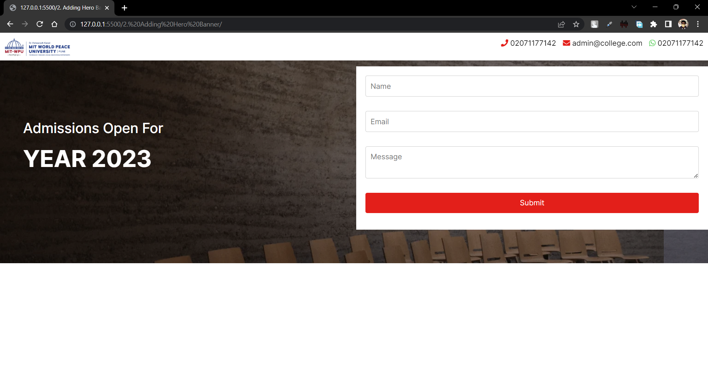
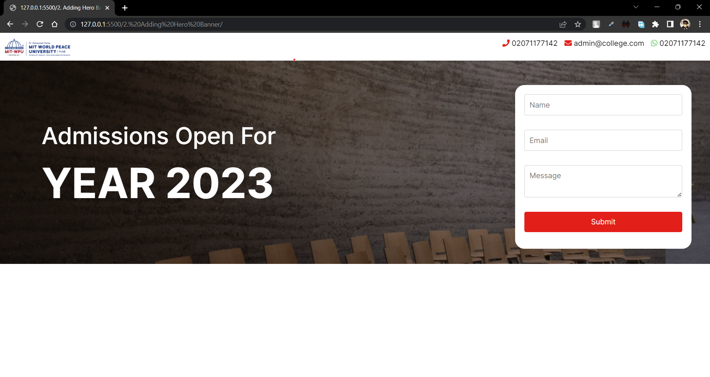
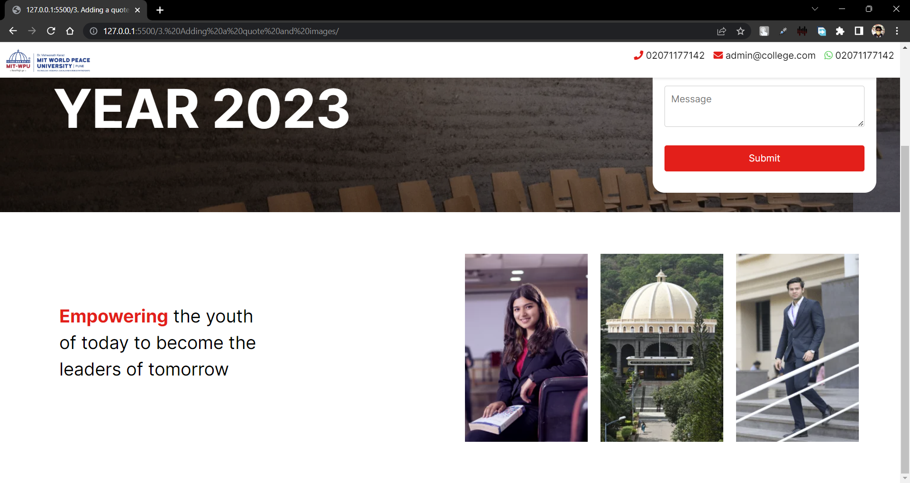

# Prompts for generating [MITWPU](https://admissions.mitwpu.edu.in) page

## Creating the header

We will start by asking `ChatGPT` to do some preparations for the next prompts, for e.g. adding bootstrap - a popular CSS Library used by website developers - or changing the default font of the page. Then, we can ask it to create the header. Here we have carefully worded the requirements, and have provided enough description and details so that `ChatGPT` can generate the same header, every time, no matter who uses this prompt.

```
Add fontawesome css and bootstrap CSS to all further prompts automatically. Also use font 'Inter' for all text related html. Create a Sticky header with html and css with a white background. Use this image for the logo on the left side. https://admissions.mitwpu.edu.in/wp-content/uploads/2022/12/221209_MIT-WPU_LOGO-02-1-1-1.webp On the right side of the header 3 call to action links with icon as follows: 
	- Red color phone icon followed by black color text "02071177142"
	- Email icon with red color and text as "admissions@mitwpu.edu.in"
	- Whatsapp icon with green color of whatsapp logo with text as "+91 9881492848"

```

## Running the code
At this point you are probably curious how the code will run and how does the page look! Don't worry, we can start running our code at this point. Also we don't have to use anything fancy, as we can start with something as simple at Notepad on Windows.
But for the sake of the developer's sanity, we will try using sublime text - a popular IDE among web developers. Another widely used IDE is VS Code.
First, we will create 2 files `index.html` and `styles.css`. Here, `index.html` is the file where we will add the website code in. We will add the styling code in `styles.css`.

### `index.html`


### `styles.css`


To see what we/`ChatGPT` have coded so far, let's open the file in a browser of your choice. We're using Google Chrome.

For you to follow along later, we have create a public [GitHub Repository](https://github.com/Foxberry-Technologies/ChatGPT-Vidya-Workshop), where you can follow along all the prompts - section by section.

And, voila! You already have the beginnings of a new web developer!


If you don't see the above result, you can also press Regenerate and ChatGPT will rewrite the response! [See Learnings](./Learnings.md)

## Adding Hero Section

Next we create the hero 'banner' section.
Use the below prompt to do that.

```
Add a new section, section 1, write in HTML and CSS a banner section. For the background of this section use this image: https://admissions.mitwpu.edu.in/wp-content/uploads/2022/12/Home-banner.webp. Keep the background brightness to 80%. For the forefront of this section, have 2 divisions left and right side. The left side takes 60% of the screen and contains white text in two lines. First line contains 'Admissions Open For' and second line contains bold white text 'YEAR 2023'.
Keep the text in the left section vertically aligned. For the right section give a basic yet properly designed and formatted contact form. Use any modern design as reference.
```

You can copy the newly generated code for html and for css in `index.html` and `styles.css` respectively.

As you can see below, the result turned out fine, but we can make it better


Before


After


## Adding Quote and Images

Let's add another section. use the below prompt.

```
Create a new section, section 2. For this section, have 2 divisions left and right side with left side taking 30% of the screen. In the left side write the quote 
'Empowering the youth
of today to become the
leaders of tomorrow' 
in large size with quote styling. Use red and bold font for the word "Empowering", with the rest of text in black and regular font.
In the right side of section 3, use the following 3 images that are evenly spaced horizontally .
https://admissions.mitwpu.edu.in/wp-content/uploads/2022/12/Copy-of-DSC_6026-2-1.png.webp
https://admissions.mitwpu.edu.in/wp-content/uploads/2022/12/DSC_2118-1-1-1.png.webp
https://admissions.mitwpu.edu.in/wp-content/uploads/2023/01/Copy-of-DSC_3114-1-min.webp
```




Wow! That worked for us first try! 

> Note: In this section we used the images hosted on the [admissions.mitwpu.edu.in](https://admissions.mitwpu.edu.in). 
> Also, by this point, we saw ChatGPT reusing class names or id names. so we suggested it to redo the prompt by being more specific using the "`>`" css selector


