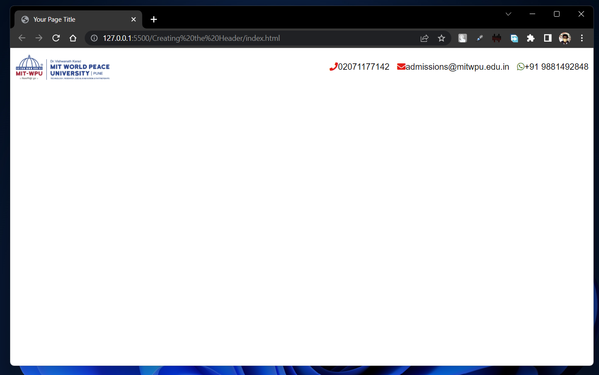

# Prompts for generating [admissions.mitwpu.edu](https://admissions.mitwpu.edu) page

## Preparations


```

```


## Creating the header

We will start by asking `ChatGPT` to do some preparations for the next prompts, for e.g. adding bootstrap - a popular CSS Library used by website developers - or changing the default font of the page. Then, we can ask it to create the header. Here we have carefully worded the requirements, and have provided enough description and details so that `ChatGPT` can generate the same header, every time, no matter who uses this prompt.

```

Add fontawesome css and bootstrap CSS to all further prompts automatically. Also use font 'Arial' for all text related html. While creating css, use ids and use id specific css, e.g. #section1 > #left_section. Create a Sticky header with html and css with a white background. Use this image for the logo on the left side. https://admissions.mitwpu.edu.in/wp-content/uploads/2022/12/221209_MIT-WPU_LOGO-02-1-1-1.webp On the right side of the header 3 call to action links with icon as follows: 
	- Red color phone icon followed by black color text "02071177142"
	- Email icon with red color and text as "admissions@mitwpu.edu.in"
	- Whatsapp icon with green color of whatsapp logo with text as "+91 9881492848"

```

## Running the code
At this point you are probably curious how the code will run and how does the page look! Don't worry, we can start running our code at this point. Also we don't have to use anything fancy, as we can start with something as simple at Notepad on Windows.
But for the sake of the developer's sanity, we will try using sublime text - a popular IDE among web developers. Another widely used IDE is VS Code.
First, we will create 2 files `index.html` and `styles.css`. Here, `index.html` is the file where we will add the website code in. We will add the styling code in `styles.css`.

### `index.html`


### `styles.css`


To see what we/`ChatGPT` have coded so far, let's open the file in a browser of your choice. We're using Google Chrome.

For you to follow along later, we have create a public [GitHub Repository](https://github.com/Foxberry-Technologies/ChatGPT-Vidya-Workshop), where you can follow along all the prompts - section by section.

And, voila! You already have the beginnings of a new web developer!

